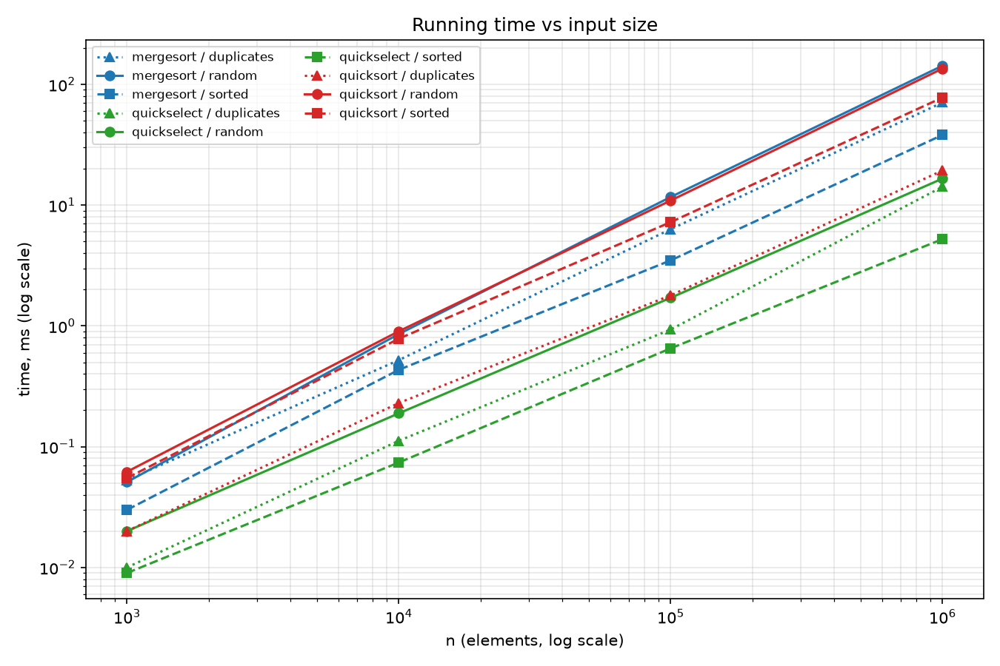
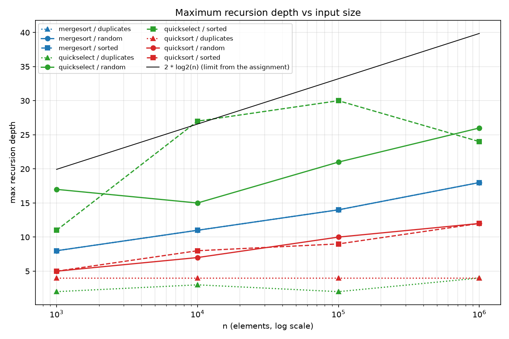
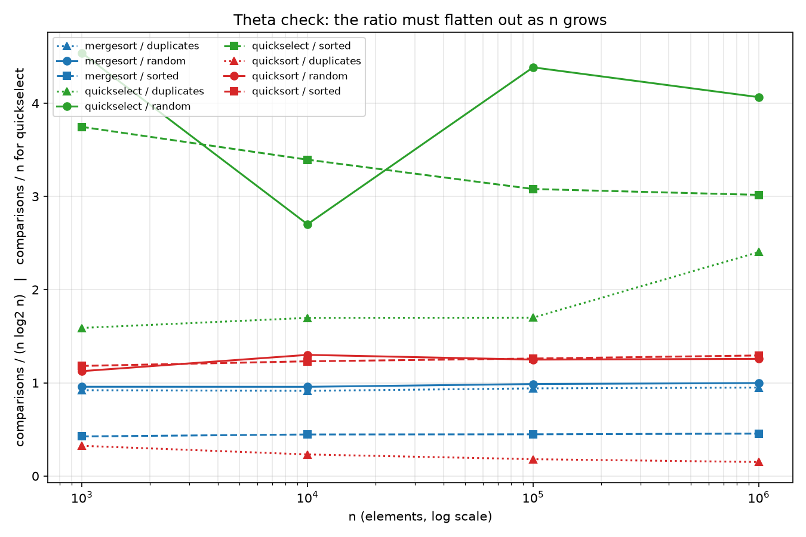

# Assignment 1 — Divide and Conquer & Asymptotic Notations

**Student:** Nurlan Yussupov, group SE-2526
**Repository:** https://github.com/Nurlan-byte/daa-assignment1-divide-and-conquer, tag `v1.0`

## 1. Asymptotic bounds

"Reason" names the input that produces this case.

| Algorithm | Best | Average | Worst | Memory | Depth |
|---|---|---|---|---|---|
| **MergeSort** | **Θ(n log n)** — the split is always exactly in half, the input cannot help | **Θ(n log n)** — same recursion tree for every permutation | **Θ(n log n)** — no input degrades it | Θ(n) | Θ(log n) |
| **QuickSort** (random pivot, 3-way) | **Θ(n log n)** — every pivot splits the range in half | **Θ(n log n)** expected — a random pivot gives a split better than 1:3 with probability 1/2 | **O(n²)** — only if the generator picks an extreme pivot at every level; no fixed input triggers it | Θ(log n) | **O(log n)** deterministic: the recursive call always gets ≤ n/2 elements |
| **QuickSort**, all-equal input | **Θ(n)** | **Θ(n)** | **Θ(n)** — the 3-way partition puts every equal element in its final place in one pass | Θ(1) | O(log n) |
| **QuickSelect** | **Θ(n)** — the first pivot already hits `k` | **Θ(n)** expected — the work is `n + n/2 + n/4 + ... < 2n` | **O(n²)** — an extremely unlucky pivot sequence; Ω(n) always, every element is inspected once | Θ(1) in place | O(log n) expected |
| **Insertion Sort** | **Θ(n)** — sorted input: the inner loop breaks after the first comparison | **Θ(n²)** — a random permutation has ≈ n²/4 inversions | **Θ(n²)** — reverse-sorted input: every element travels to the beginning | Θ(1) | Θ(1) |

Θ is used where the upper and lower bounds coincide. For the worst case of QuickSort and
QuickSelect only `O` is written: with a random pivot the quadratic bound is not tight for any
concrete input, so `Θ(n²)` would be a wrong statement.

## 2. Recurrences and the Master Theorem

### MergeSort

    T(n) = 2·T(n/2) + Θ(n)        a = 2, b = 2, f(n) = Θ(n)
    n^(log_b a) = n^(log_2 2) = n
    f(n) = Θ(n^(log_b a))  ->  case 2  ->  T(n) = Θ(n log n)

`f(n) = Θ(n)` is the merge, which touches every element once. The cutoff at 15 removes the bottom
`log2(15) ≈ 3.9` levels; the work in the leaves is `Θ((n/15)·15²) = Θ(n)`, so the asymptotics stay
the same and only the constant improves.

### QuickSort (balanced split assumed)

    T(n) = 2·T(n/2) + Θ(n)        a = 2, b = 2, f(n) = Θ(n)
    n^(log_2 2) = n  ->  case 2  ->  T(n) = Θ(n log n)

**Why a random pivot gives O(n log n) on average.** Call a pivot "good" if it splits the range at
least 1:3. Half of all positions are good, so a good pivot is picked with probability 1/2, i.e. on
average every second level shrinks the size by at least 3/4, giving `O(log n)` expected levels at
`Θ(n)` each. The exact expected comparison count is `2n·ln n ≈ 1.39·n·log2 n`. The randomness is in
the **algorithm**, not in an assumption about the input, so an adversary who knows the array cannot
force the quadratic case.

### QuickSelect

    T(n) = 1·T(n/2) + Θ(n)        a = 1, b = 2, f(n) = Θ(n)
    n^(log_b a) = n^(log_2 1) = n^0 = 1
    f(n) = Θ(n) = Ω(n^(0+ε)) with ε = 1, polynomially larger than n^0
    regularity: a·f(n/b) = n/2 ≤ c·f(n) with c = 1/2 < 1  ->  case 3
    T(n) = Θ(f(n)) = Θ(n)

This is the different Master Theorem case: only **one** subproblem is solved, so the work per level
forms a converging geometric series `n + n/2 + n/4 + ... = 2n` and the cost is dominated by the root
rather than by the leaves. In QuickSort the same sum is `n + n + n + ...`, where every level costs
the full `n` and the result depends on the number of levels.

## 3. Plots

## 4. Θ check

Measured `comparisons / (n·log2 n)` for the sorts and `comparisons / n` for QuickSelect:

| Algorithm / input | n=10³ | n=10⁴ | n=10⁵ | n=10⁶ | verdict |
|---|---|---|---|---|---|
| mergesort / random | 0.958 | 0.957 | 0.987 | 0.998 | constant → **Θ(n log n)**, c₁ = 0.95, c₂ = 1.05, n₀ = 10³ |
| mergesort / sorted | 0.425 | 0.446 | 0.448 | 0.455 | constant, ≈2× lower: the left half runs out first and the right tail is copied without comparisons |
| mergesort / duplicates | 0.921 | 0.914 | 0.940 | 0.949 | constant, c₁ = 0.90, c₂ = 0.96 |
| quicksort / random | 1.125 | 1.300 | 1.249 | 1.258 | constant ≈1.26, below the theoretical 1.386 because of the cutoff; c₁ = 1.10, c₂ = 1.35 |
| quicksort / sorted | 1.181 | 1.231 | 1.261 | 1.294 | same as random — the random pivot removed the dependency on input order |
| quicksort / duplicates | 0.324 | 0.232 | 0.181 | 0.151 | **falls like 1/log n** — the model `n log n` is wrong here |
| quickselect / random | 4.54 | 2.70 | 4.39 | 4.07 | bounded, no growth → **Θ(n)**, c₁ = 1.5, c₂ = 4.6, n₀ = 10³ |
| quickselect / sorted | 3.75 | 3.39 | 3.08 | 3.02 | same |
| quickselect / duplicates | 1.59 | 1.70 | 1.70 | 2.40 | same |

`Θ(g(n))` means `c₁·g(n) ≤ f(n) ≤ c₂·g(n)` for all `n ≥ n₀`. For MergeSort on random data the ratio
stays inside `[0.95, 1.05]` from `n₀ = 1000`, so the bound is tight; for QuickSort it lies in
`[1.10, 1.35]`.

**The exception is `quicksort / duplicates`:** the ratio falls instead of flattening, so `n log n`
is an over-estimate. The 3-way partition places all copies of the pivot at once, and with only 10
distinct values the recursion is ~4 levels deep (confirmed by the depth plot). Dividing the same
data by `n` gives **3.23 / 3.08 / 3.00 / 3.00** — a constant. On this input QuickSort is `Θ(n)`,
not `Θ(n log n)`, and the ratio plot is what makes it visible.

## 5. Discussion

Environment: AMD Ryzen 7 7435HS, 24 GB RAM, Windows 11, JDK 21, 5 runs per case, median time.

The measurements match the theory. Both sorts show a constant comparison ratio, confirming
`Θ(n log n)`, and QuickSelect stays linear: 16.6 ms against 142.7 ms for MergeSort at `n = 10⁶`.
Recursion depth behaves as designed — "smaller side first" keeps QuickSort at depth 12 for a million
elements and at 9 on a sorted array of 100 000, against the limit of 33. The main deviation is that
MergeSort beats QuickSort on sorted input (38.1 ms vs 77.8 ms), because the 3-way partition performs
many swaps while `merge` moves memory through `System.arraycopy`, which the JVM compiles into a
vectorised block copy, and because MergeSort needs only half as many comparisons there. Other
sources of difference are JIT warm-up (the first runs are several times slower, hence the explicit
warm-up phase and the median of 5 runs), the garbage collector (the 4 MB buffer at `n = 10⁶` can
trigger a pause inside a measurement) and the cache hierarchy (an `int[]` of 10⁶ elements is 4 MB and
no longer fits in L2, so the growth from `n = 10⁵` to `10⁶` is slightly steeper than the pure model
predicts). The cutoff at 15 is a constant-factor optimisation of the same kind. Finally, the
duplicates case shows that an asymptotic bound is only as good as the model behind it: the same code
is `Θ(n log n)` on random data and `Θ(n)` when the number of distinct values is constant.
